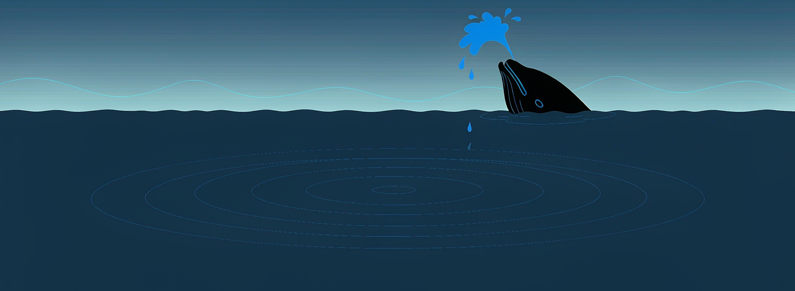

<div align="center">



# 鲸息 Whale Breath

**DeepSeek Harness 的纯粹呼吸伴生插件**

只呈现基础调用事实与呼吸轨迹，别无他物。

[](https://github.com/brittanistrehlowll-oss/whale-breath/releases/tag/V1.0.1)
[](LICENSE)
[](https://github.com/anywhere-labs/dsh-desktop)
[](#-测试)
[](#-测试)

[特性](#-特性一览) · [界面](#-界面展示) · [呼吸语言](#-呼吸语言) · [快速开始](#-快速开始) · [架构](#-架构) · [测试](#-测试) · [路线图](#-路线图)

</div>

> [!NOTE]
> 本仓库（whale-breath）是鲸息的**独立发布主页**，自 dsh-control-center monorepo 析出，后续版本均在此发布。鲸息是第三方/社区兼容项目，**并非 DeepSeek 官方产品**。

## 🐋 这是什么

鲸息（jingxi）是 DeepSeek Harness（DSH）的轻量伴生插件——一个**只读的 Turn 遥测解读层**。
它在宿主侧边栏放一头鲸鱼，**点击直达呼吸轨迹浮层**：五张调用事实卡、一条呼吸曲线、
一条事件轨。没有计费、没有额度、没有面板迷宫。

**V1.0.1 Pure Breath** 是一次「纯粹化」发布，两轮剥离：

1. **剥离计费/额度** —— quota 适配层、额度面板、余额/套餐素材与图层全部移除；
2. **剥离中间面板与快捷操作** —— 鲸息面板、DSH 更新浮层、侧栏快捷操作行
   （呼吸轨迹/重启/检查更新）与「当前版本」行全部移除；侧栏入口点击**直接**打开呼吸轨迹页。

## ✨ 特性一览

| 特性 | 说明 |
| --- | --- |
| 🐳 直达呼吸轨迹 | 侧栏鲸鱼入口（wide/rail 双形态），点击即开浮层，无中间页 |
| 📇 五张调用事实卡 | 轮次/步数、Token、时长、Cache 命中、速度——只讲事实 |
| 🌊 Breath Curve | 呼吸曲线：事件刻度、游标、图例，节奏一目了然 |
| 🛤️ Event Rail | 事件轨 + 最近 5 轮 + 阶段故事 + 子代理 Dock |
| ⚡ 入口实时态 | 侧栏入口随线程状态呼吸，实时 tok/s 速率 |
| 🩺 设置区 Doctor | 版本/运行状态/诊断修复；DSH 更新检查收敛为**只读诊断** |
| 🛡️ fail-closed | 无真实数据 = 空轨道/未知态，绝不伪造轨迹 |
| 🎨 DSH Native | 外壳/按钮/遮罩遵循宿主 tokens，亮暗主题自然跟随 |

## 🖼️ 界面展示

> 界面截图将在 DSH Desktop 实地验证后补入此节。

<!--
待补截图（docs/images/）：
- breath-surface.png   呼吸轨迹浮层全景（事实卡 + Breath Curve + Event Rail）
- sidebar-entry.png    侧栏鲸鱼入口（wide 与 rail 两态）
- settings-doctor.png  设置区 · 诊断与修复（只读更新检查）
-->

## 🌊 呼吸语言

鲸息用「鲸鱼 + 喷水」的视觉语言表达运行状态。以下图标均为本仓库真实素材。

**呼吸八阶段** —— 一轮调用的完整生命：

<table>
  <tr>
    <td align="center"><br><sub><b>点火</b></sub></td>
    <td align="center"><br><sub><b>加速</b></sub></td>
    <td align="center"><br><sub><b>巡航</b></sub></td>
    <td align="center"><br><sub><b>峰值</b></sub></td>
  </tr>
  <tr>
    <td align="center"><br><sub><b>湍流</b></sub></td>
    <td align="center"><br><sub><b>着陆</b></sub></td>
    <td align="center"><br><sub><b>中断</b></sub></td>
    <td align="center"><br><sub><b>完成</b></sub></td>
  </tr>
</table>

**品牌七态** —— 呼吸质量的身份表达（黑鲸 + 蓝喷，不作通用动作图标）：

<table>
  <tr>
    <td align="center"><br><sub><b>静息</b></sub></td>
    <td align="center"><br><sub><b>活跃</b></sub></td>
    <td align="center"><br><sub><b>实时</b></sub></td>
    <td align="center"><br><sub><b>高效</b></sub></td>
  </tr>
  <tr>
    <td align="center"><br><sub><b>顺滑</b></sub></td>
    <td align="center"><br><sub><b>完美呼吸</b></sub></td>
    <td align="center"><br><sub><b>最佳呼吸</b></sub></td>
    <td align="center"></td>
  </tr>
</table>

**喷水三态与连接状态** —— 侧栏入口的语义信号（非装饰）：

<table>
  <tr>
    <td align="center"><br><sub><b>静息喷</b></sub></td>
    <td align="center"><br><sub><b>轻喷</b></sub></td>
    <td align="center"><br><sub><b>稳定喷</b></sub></td>
    <td align="center"><br><sub><b>已连接</b></sub></td>
  </tr>
  <tr>
    <td align="center"><br><sub><b>连接中</b></sub></td>
    <td align="center"><br><sub><b>处理中</b></sub></td>
    <td align="center"><br><sub><b>已暂停</b></sub></td>
    <td align="center"><br><sub><b>离线</b></sub></td>
  </tr>
</table>

## 🚀 快速开始

**前置条件**：DSH 0.1.x（CLI 或 [DSH Desktop](https://github.com/anywhere-labs/dsh-desktop)）；Windows PowerShell。

```powershell
# 1. 获取代码
git clone https://github.com/brittanistrehlowll-oss/whale-breath.git
cd whale-breath

# 2. 幂等安装：部署到 <DSH home>/profiles/node_modules/dsh-jingxi
#    并向 cordis.patch.yml 注入 dsh-jingxi 插件行（inject: [webServer]）
powershell -ExecutionPolicy Bypass -File skill/jingxi/scripts/install.ps1

# 3. 重启 DSH，点击侧栏鲸鱼入口 —— 直达呼吸轨迹
```

> [!TIP]
> DSH Desktop 用户的 harness home 在 `%APPDATA%/dsh-desktop/harness/`，需同步部署；
> 卸载、诊断等更多脚本见 `skill/jingxi/scripts/`，完整说明见 `skill/jingxi/SKILL.md`。

## 🏗️ 架构

鲸息分两半，宿主内运行，不引入任何外部服务：

| 半区 | 文件 | 职责 |
| --- | --- | --- |
| **host 半** | `lib/index.js` · `lib/telemetry-fold.js` · `lib/dsh-update.js` · `lib/asset-route.js` | fail-closed API：遥测折叠、投影、只读更新检查、素材路由 |
| **浏览器半** | `lib/client.js` | React 渲染：侧栏入口、呼吸轨迹浮层、Settings 区（DSH Native tokens） |

```text
lib/            浏览器半（client.js）+ host 半（index.js、telemetry-fold 等）
assets/icons/   本地补充素材（喷水/状态徽标）；鲸鱼主体一律用 DSH 官方 FishLogo
test/           node:test 套件（harness 用 vm 加载 client.js 跑组件级断言）
skill/jingxi/   安装/卸载/诊断脚本 + SKILL.md + 架构与排障参考
cordis.patch.yml 插件启用补丁样例
docs/images/    README 用图（横幅、界面截图）
```

**设计原则**：

- **fail-closed** —— 轨迹与阶段只在有真实 projection 数据时绘制，缺失数据保持空轨道/未知状态，不伪造；
- **Cache First** —— 事实卡优先读缓存投影，避免重复拉取；
- **Native by default** —— 通用外壳遵循 DSH Native tokens，视觉归属感交给宿主。

## 🧪 测试

```bash
node --test "test/*.test.mjs"
```

当前基线：**213/213 通过**（Node 22）。测试 harness 用 `node:vm` 加载 `client.js`，
配合自实现的 React shim 做组件级断言；CLI home 与 Desktop harness home
两种部署形态均同步验证通过。

## 🗺️ 路线图

- [x] **V1.0.1 Pure Breath** —— 剥离计费/额度，侧栏入口直达呼吸轨迹
- [ ] 受控更新通道（复用保留的 host 端点，fail-closed）
- [ ] Perfect Breath 分享（share 层已预留）
- [ ] 更多轨迹解读维度

## 🤝 贡献与许可

欢迎 Issue 与 PR。本仓库以 [MIT License](LICENSE) 发布。

**商标声明**：DeepSeek 是 DeepSeek AI 的商标。鲸息（Whale Breath）是独立的
第三方/社区兼容项目，与 DeepSeek 官方无隶属关系。

**致谢**：[DeepSeek Harness](https://github.com/anywhere-labs/dsh-desktop) 与
DSH Desktop 社区——鲸息运行在它们的肩膀之上。

<div align="center">

<sub>🐋 呼吸之间，事实自现。</sub>

</div>
