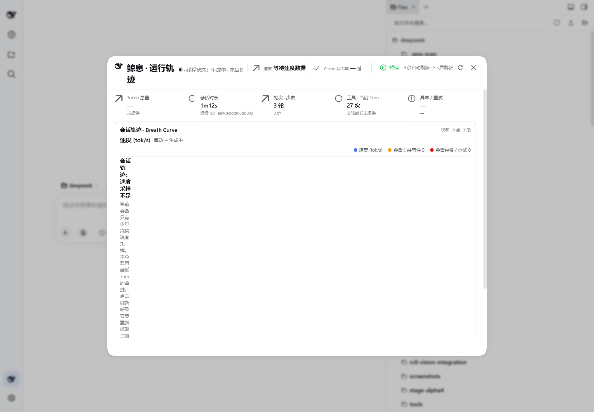
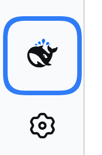

<div align="center">


# 鲸息 Whale Breath

**DeepSeek Harness 的纯粹呼吸伴生插件**

只呈现基础调用事实与呼吸轨迹，别无他物。

[](https://github.com/brittanistrehlowll-oss/whale-breath/releases/tag/V1.0.2)
[](LICENSE)
[](https://github.com/anywhere-labs/dsh-desktop)
[](#-测试)
[](https://github.com/brittanistrehlowll-oss/whale-breath/actions/workflows/test.yml)

[实机界面](#-实机界面) · [特性](#-特性一览) · [呼吸语言](#-呼吸语言) · [快速开始](#-快速开始) · [架构](#-架构) · [测试](#-测试) · [路线图](#-路线图)

</div>

> [!NOTE]
> 本仓库（whale-breath）是鲸息的**独立发布主页**，自 dsh-control-center monorepo 析出，后续版本均在此发布。鲸息是第三方/社区兼容项目，**并非 DeepSeek 官方产品**。

## 🐋 这是什么

鲸息（jingxi）是 DeepSeek Harness（DSH）的轻量伴生插件——一个**只读的 Turn 遥测解读层**。
它在宿主侧边栏放一头鲸鱼，**点击直达呼吸轨迹浮层**：五张调用事实卡、一条呼吸曲线、
一条事件轨。没有计费、没有额度、没有面板迷宫。

- **V1.0.1 Pure Breath**：剥离计费/额度与中间面板，界面只剩事实与轨迹。
- **V1.0.2 可靠修复版**：安装/更新脚本重写（装得上、可回滚）、会话切换不再卡死、
  刷新不再闪清、后端默认只读、CI 上线。

## 🖼️ 实机界面

以下截图均来自 DSH web 实机运行（1440×1000），未做任何修饰。

**呼吸轨迹浮层** —— 点开鲸鱼就是这个页面，没有中间层：



| 图中可见 | 说明 |
| --- | --- |
| 五张事实卡 | Token 总量、会话时长（附真实运行 ID）、轮次/步数、当前 Turn 工具次数、异常/重试 |
| Breath Curve 区 | 速度曲线 + 事件刻度 + 图例；采样不足时展示**真实空态文案**而非伪造曲线 |
| 空态文案 | 「不会混用最近 Turn 的曲线」——fail-closed 不是口号，是界面默认行为 |
| 顶栏 | 线程状态、速度、Cache 命中率、自动刷新节拍（5s） |

**侧栏鲸鱼入口** —— rail 收起态常驻，wide 展开态附带线程状态与 tok/s：



## ✨ 特性一览

| 特性 | 说明 |
| --- | --- |
| 🐳 直达呼吸轨迹 | 侧栏鲸鱼入口（wide/rail 双形态），点击即开浮层，无中间页 |
| 📇 五张调用事实卡 | 轮次/步数、Token、时长、Cache 命中、速度——只讲事实 |
| 🌊 Breath Curve | 呼吸曲线：事件刻度、游标、图例，节奏一目了然 |
| 🛤️ Event Rail | 事件轨 + 最近 5 轮 + 阶段故事 + 子代理 Dock |
| 🔀 会话切换可靠 | 切换会话自动跟随宿主当前会话，旧请求迟到响应不会盖错数据（V1.0.2） |
| 🔄 刷新不闪清 | 同会话刷新保留上一帧并提示「更新中」；12s 超时给出重试入口（V1.0.2） |
| 🩺 设置区 Doctor | 版本/运行状态/诊断修复；DSH 更新检查收敛为**只读诊断** |
| 🛡️ fail-closed | 无真实数据 = 空轨道/未知态，绝不伪造轨迹 |
| 🔒 后端默认只读 | lifecycle 写端点默认不注册，`jingxiOps` 显式开启才存在（V1.0.2） |
| 🎨 DSH Native | 外壳/按钮/遮罩遵循宿主 tokens，亮暗主题自然跟随 |

## 🌊 呼吸语言

鲸息用「鲸鱼 + 喷水」的视觉语言表达一轮调用的完整生命（图标均为本仓库真实素材）：

<table>
  <tr>
    <td align="center"><br><sub><b>点火</b></sub></td>
    <td align="center"><br><sub><b>加速</b></sub></td>
    <td align="center"><br><sub><b>巡航</b></sub></td>
    <td align="center"><br><sub><b>峰值</b></sub></td>
  </tr>
  <tr>
    <td align="center"><br><sub><b>湍流</b></sub></td>
    <td align="center"><br><sub><b>着陆</b></sub></td>
    <td align="center"><br><sub><b>中断</b></sub></td>
    <td align="center"><br><sub><b>完成</b></sub></td>
  </tr>
</table>

## 🚀 快速开始

**前置条件**：DSH 0.1.x（CLI 或 [DSH Desktop](https://github.com/anywhere-labs/dsh-desktop)）；Windows PowerShell。

```powershell
# 1. 获取代码
git clone https://github.com/brittanistrehlowll-oss/whale-breath.git
cd whale-breath

# 2. 幂等安装：自动探测 CLI home 与 Desktop harness 并逐端部署
powershell -ExecutionPolicy Bypass -File skill/jingxi/scripts/install.ps1

# 3. 重启 DSH，点击侧栏鲸鱼入口 —— 直达呼吸轨迹
```

> [!TIP]
> 安装脚本会**自动探测** CLI home 与 Desktop harness（`%APPDATA%/dsh-desktop/harness/`）
> 并逐端部署与校验；源文件缺失会在任何写动作之前终止，绝不留「假完成」。
> 更新（含备份回滚）、卸载、诊断脚本见 `skill/jingxi/scripts/`，完整说明见 `skill/jingxi/SKILL.md`。

## 🔒 默认只读的后端

鲸息定位为只读遥测层，这不只是界面承诺：

- 只读端点：`/api/jingxi/update`（GET 检查）、`/update/status`、`/status`、`/breath/current`、素材路由；
- 写端点 `/api/jingxi/lifecycle`（重启/更新）**默认不注册**——路由层即 404；
  仅当插件配置 `jingxiOps: true` 显式开启时才注册，且保留同源/回环/基线验证全部保护。
  运维能力因此成为可审计的**可选模块**，而非默认面。

## 🏗️ 架构

| 半区 | 文件 | 职责 |
| --- | --- | --- |
| **host 半** | `lib/index.js` · `lib/telemetry-fold.js` · `lib/dsh-update.js` · `lib/asset-route.js` | fail-closed API：遥测折叠、投影、只读更新检查、素材路由 |
| **浏览器半** | `lib/client.js` | React 渲染：侧栏入口、呼吸轨迹浮层、Settings 区（DSH Native tokens） |

```text
lib/            浏览器半（client.js）+ host 半（index.js、telemetry-fold 等）
assets/icons/   本地补充素材（喷水/状态徽标）；鲸鱼主体一律用 DSH 官方 FishLogo
test/           node:test 套件（harness 用 vm 加载 client.js 跑组件级断言）
skill/jingxi/   安装/更新/卸载/诊断脚本 + SKILL.md + 架构与排障参考
cordis.patch.yml 插件启用补丁样例
docs/images/    README 用图（横幅、实机截图）
```

**设计原则**：fail-closed（缺数据宁空不假）；Cache First（事实卡优先读缓存投影）；
Native by default（视觉归属感交给宿主）。

## 🧪 测试

```bash
node --test "test/*.test.mjs"
```

当前基线：**220/220 通过**（Node 22 / 24，GitHub Actions 矩阵自动运行，见 CI 徽章）。
测试 harness 用 `node:vm` 加载 `client.js`，配合自实现的 React shim 做组件级断言；
CLI home 与 Desktop harness home 两种部署形态均同步验证通过。

## 🗺️ 路线图

- [x] **V1.0.1 Pure Breath** —— 剥离计费/额度，侧栏入口直达呼吸轨迹
- [x] **V1.0.2 可靠修复版** —— 安装/更新重写、会话切换修复、刷新状态机、后端默认只读、CI
- [ ] 受控更新通道（`jingxiOps` 已预留开关）
- [ ] Perfect Breath 分享（share 层已预留）
- [ ] 更多轨迹解读维度

## 🤝 贡献与许可

欢迎 Issue 与 PR。本仓库以 [MIT License](LICENSE) 发布。

**商标声明**：DeepSeek 是 DeepSeek AI 的商标。鲸息（Whale Breath）是独立的
第三方/社区兼容项目，与 DeepSeek 官方无隶属关系。

**致谢**：[DeepSeek Harness](https://github.com/anywhere-labs/dsh-desktop) 与
DSH Desktop 社区——鲸息运行在它们的肩膀之上。

<div align="center">

<sub>🐋 呼吸之间，事实自现。</sub>

</div>
